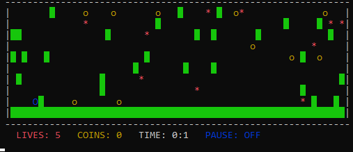

# Hra typu “Mario” - pohyb hráče v labyrintu

## POPIS



Hra představuje interpretaci hry "Mario". Hráč může ovládat postavu (modrý kruh), překonávat 
překážky (zelené bloky), sbírat mince (žluté kruhy) a vyhýbat se nepřátelům (červené hvězdy). 
Pokud se postava srazí s nepřítelem, ztratí 1 život. Postava se plynule pohybuje doprava.
Lze jej také posunout doprava, doleva a nahoru stisknutím tlačítek. Hru lze pozastavit.
Hra skončí, když postava ztratí všechny životy nebo dosáhne pravého okraje pole.
Program automaticky vyhodnotí výsledek hry a tyto imformace zobrazí na terminál.
Pod hracím polem se zobrazují informace o počtu životů, nasbíraných mincích, době hry a zda je hra pozastavena.

## KOMPILACE PROGRAMU
Program lze zkompilovat následujícím příkazem:
```bash
cmake -Bcmake-build-debug -H. -DCMAKE_BUILD_TYPE=Debug
cmake --build cmake-build-debug
```

## SPUŠTĚNÍ A PŘEPÍNANÍ
Hra se spouští z příkazové řádky.
Parametry nastavení programu:
- -c (-coins) - počet minci,
- -e (-enemies) - počet nepřateli,
- -l (-lives) - počet životů.

Pokud nejsou parametry programuza dány, jsou využity předefinované hodnoty: c = 10, e = 10, l = 5.

Příklady spuštění programu: 
```bash
Mario
Mario -c 5 -e 5 -l 5
```

## OVLÁDÁNÍ PROGRAMU

- `w` - UP
- `a` - LEFT
- `d` - RIGHT
- `q` - QUITE GAME
- `p` - PAUSE GAME
- `r` - RUN GAME

Při zadávání vstupů je vyžadováno jejich potvrzení klávesou `ENTER`.

## UKONČENÍ PROGRAMU
Program se automaticky ukončí, když hráč dosáhne konce pole napravo nebo ztratí všechny životy. 
Program je možné kdykoliv ukončit klávesou `q`.

## TESTOVÁNÍ PROGRAMU

Testy jsou ve složce "tests".
